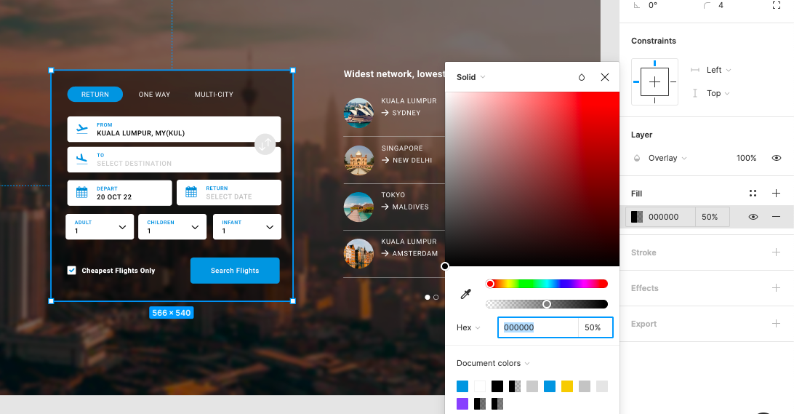

#### Audit

###### Is the deliverable labeled as “Name_FirstName_DeliverableName_Date_VersionNumber”?
###### Is the deliverable in the correct format (Figma)?
###### Is there a title within the document?
###### Is the document clear, simple and easy to read?
###### Does the designed screen match the image?
###### Do all layers have a name and belong to a group of graphic elements?
    
    
    

###### Are there 2 pages: one for the screen and one with the symbols?
    
    
    
    

###### Have masks been used to change the shape of the image?
    
    
    

###### Is the overlay done with transparency?
    
    
    
    
