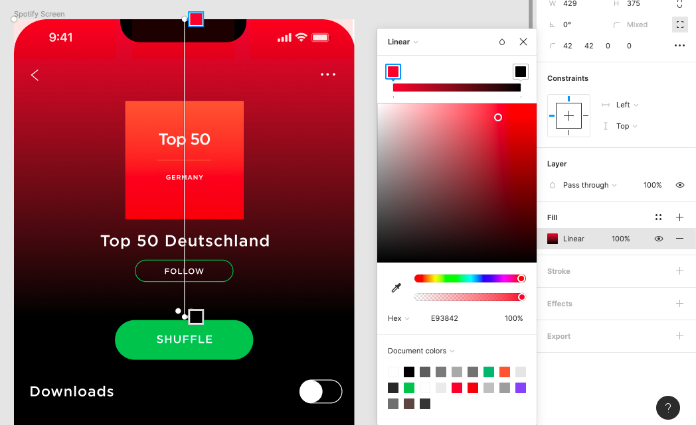

#### Audit

###### Is the deliverable labeled as “Name_FirstName_DeliverableName_Date_VersionNumber”?
###### Is the deliverable in the correct format (Figma)?
###### Is there a title within the document?
###### Is the document clear, simple and easy to read?
###### Does the designed screen match the image
###### Are there 2 pages: one for the screen and one with the symbols?
    
    

###### Are there symbols and variants for the songs in the Symbols page?
###### Is the background made with linear color?
    
    

###### Are all the elements gathered in groups?
###### Are all the layers names and organized?
###### Is there Apple Design System (head bar)?
