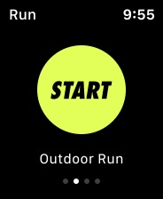
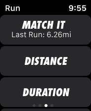

# UI I - Ex 8 - UI Challenge - Watches

**Instructions:** 

Copy these images on Figma

**Deliverable:** 

- A Figma file with a copy of the image with Figma elements
- Make sure:
    - You use symbols and variants
    - All your layers are named and organized
    - You use overlays
    - You use masks to change the shape of the imported image
- Upload the Figma file on Github, labeled as follows: “Name_FirstName_DeliverableName_Date_VersionNumber”. For example, it can be labeled as “Doe_John_MidFiPrototype_05242024_V1”.
- Add a title within the file.
- Pay attention to the global aspect of the file. It must be clear, simple and easy to read. You can get inspiration on canva.com but don’t overload your design with too much details!

**Tips:** 

- Fonts: SF Compact for the iOS elements,  Futura STD Condensed for the Nike signs
- The frame for each iWatch screen is watch 44 mm 184 x 224
- [Figma article about Symbols and Variants](https://help.figma.com/hc/en-us/articles/360056440594-Create-and-use-variants)
- You can use existing Libraries by browsing the Figma community resources